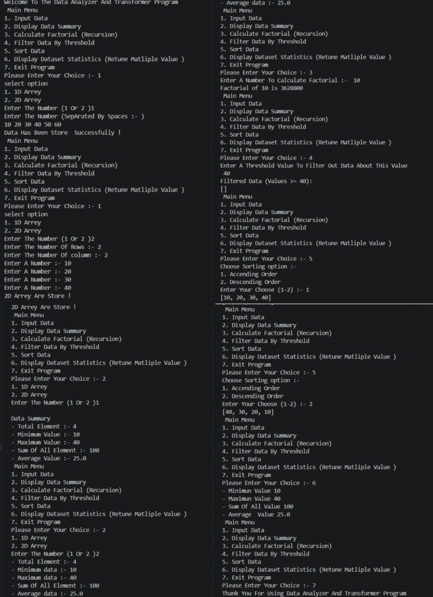

# Data Analyzer And Transformer Program

## Subtitle
A Python-based console application to analyze, transform, and process user-provided data using different operations like summary calculation, sorting, filtering, and factorial calculation.

---

# Features

- Input data in **1D Array** and **2D Array** format
- Display complete data summary
- Calculate factorial using recursion
- Filter data based on user-defined threshold value
- Sort data in:
  - Ascending Order
  - Descending Order
- Display dataset statistics:
  - Minimum Value
  - Maximum Value
  - Sum of Elements
  - Average Value
- Interactive menu-driven program
- Handles multiple data operations easily

---

# Technologies Used

- **Programming Language:** Python

- **Editor:** VS Code 

---

# Concepts Used

The following Python concepts are used in this project:

- Variables
- Lists
- Global Variables
- Functions
- Recursion
- Conditional Statements (`if-else`)
- Loops (`for`, `while`)
- User Input Handling
- List Methods
- Sorting Techniques
- Data Filtering
- Mathematical Operations
- Return Multiple Values

---

# How To Use

1. Run the Python program.
2. Select an option from the Main Menu.

```
1. Input Data
2. Display Data Summary
3. Calculate Factorial (Recursion)
4. Filter Data By Threshold
5. Sort Data
6. Display Dataset Statistics
7. Exit Program
```

3. Enter your choice.
4. Provide required data input.
5. View the generated output.

---

# Installation

### Step 1: Install Python

Download and install Python from:

```
https://www.python.org/
```

### Step 2: Clone or Download Project

Download the project files into your system.

### Step 3: Run Program

Open terminal:

```
python main.py
```

---

# Example Output

```
Welcome To The Data Analyzer And Transformer Program

Main Menu

1. Input Data
2. Display Data Summary
3. Calculate Factorial (Recursion)
4. Filter Data By Threshold
5. Sort Data
6. Display Dataset Statistics
7. Exit Program


Enter Your Choice :- 1

Select Option

1. 1D Array
2. 2D Array

Enter The Number :- 1

Enter The Number (Separated By Spaces):-
10 20 30 40

Data Has Been Store Successfully!
```

### Data Summary Output

```
Data Summary

Total Element :- 4
Minimum Value :- 10
Maximum Value :- 40
Sum Of All Element :- 100
Average Value :- 25.0
```

### Factorial Output

```
Enter A Number To Calculate Factorial :- 10

Factorial of 10 is 3628800
```

### Sorting Output

```
Ascending Order:

[10, 20, 30, 40]


Descending Order:

[40, 30, 20, 10]
```

### Output 



---

# Project Structure

```

│
├── README.md
│
├── main.py
│
└── output.png
    
```

---

# Author

**Dev Thakkar**
